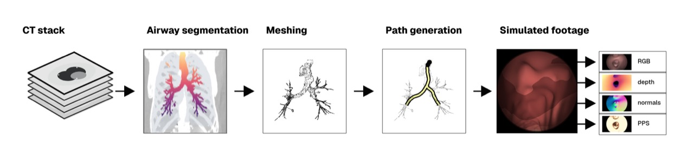
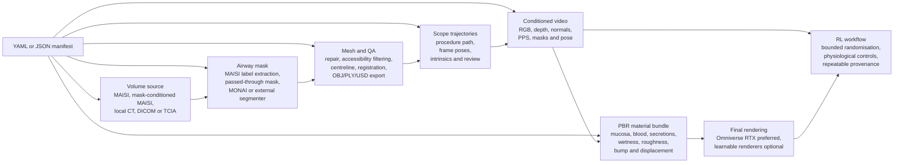

<h2 align="center">SynAirG: Generative Worlds for Adaptive Training of Bronchoscopy SLAM Models</h2>

<p align="center">
  <a href="https://huggingface.co/datasets/chrisvoncsefalvay/1000lungs"></a>
  <a href="https://huggingface.co/spaces/chrisvoncsefalvay/1000lungs-dataset-viewer"></a>
  <a href="https://hcltech-robotics.github.io/synairg/"></a>
  <a href="https://openreview.net/forum?id=hQ7X3AAlme"></a>
</p>

`synairg` turns generated or imported thoracic CT into physiologically plausible
intraluminal airway environments for robotics, reinforcement learning,
simulation, rendering, perception and SLAM. A scan enters the system, an airway
mask is obtained, a bronchoscopy-ready mesh is built and QA'd, scope trajectories
are sampled, and the renderer emits video plus aligned RGB, depth, normals,
per-pixel shading, masks, pose and PBR-ready material assets.

The package is built around a manifest-first contract. Every case can be driven
from YAML or JSON, while every stage remains available as an ordinary CLI
command for local debugging, cluster execution or RL workflow orchestration.

<p align="center">
  
</p>

## Quick start

Clone the repo, install the editable package and validate the bundled manifest:

```bash
git clone git@github.com:hcltech-robotics/synairg.git
cd synairg
python -m venv .venv
source .venv/bin/activate
python -m pip install --upgrade pip
python -m pip install -e ".[dev]"
synairg pipeline validate --manifest configs/synairg_pipeline.yml
```

Plan the complete case workflow before running it:

```bash
mkdir -p runs
synairg pipeline plan --manifest configs/synairg_pipeline.yml
synairg pipeline plan --manifest configs/synairg_pipeline.yml --shell > runs/airway-case-001-plan.sh
```

Run the generated shell plan on a host with the requested MAISI, segmentation
and Omniverse integrations available:

```bash
bash runs/airway-case-001-plan.sh
```

For a CPU-only smoke test, install the package and use the status or validation
commands first. The heavyweight generation and RTX capture stages are invoked
only when their external backends are present.

## Workflow overview



A run begins with a manifest that names the case, declares the volume source and
records where outputs should be written. The volume stage either imports an
existing CT, pulls a reproducible source series or asks a MAISI-compatible
backend to generate a thoracic case. The mask stage then supplies the binary
airway mask through generated labels, a precomputed mask, a MONAI bundle or an
external segmentation command.

The mesh stage turns that mask into a bronchoscopy-ready airway surface. It
repairs topology, filters unreachable branches according to the bronchoscope
profile, writes the centreline graph and produces QA artefacts that make failed
or implausible anatomy visible before rendering. The pose stage samples distal
target paths and optional procedure-style trajectories over that centreline,
with camera intrinsics and frame metadata saved alongside the path JSON.

The video stage renders the selected path from the scope viewpoint and writes
aligned RGB, depth, normal, per-pixel shading and mask channels. The material
stage then applies an anatomy-aware mucosal PBR model, including authorable
maps for secretions, erythema, wetness, roughness, bump and displacement. The
same geometry and material bundle can be sent to Omniverse RTX for final
path-traced stills or sequences, or consumed by a learning workflow as fast
condition frames.

The core invariant is that mesh geometry, rendered appearance and RL variation
remain linked to the same case provenance. You can alter material maps, lighting,
camera cadence or secretion load without losing the original CT, mask, mesh,
centreline and pose lineage.

## What this repo contains

- `libs/synairg_core/`
  The public CLI, shared validation helpers, volume schemas and manifest-driven
  pipeline planner.
- `packages/volume_gen/`
  Local NIfTI/DICOM import, TCIA pulls and NVIDIA MAISI/NV-Generate backend
  wrappers.
- `packages/mesh_gen/`
  Airway mask ingestion, MONAI/external segmenter hooks, topology repair,
  marching-cubes meshing, centreline extraction, bronchoscope accessibility
  filtering, QA reports, registration sidecars and OBJ/PLY/USD export.
- `packages/pose_gen/`
  Bronchoscope path generation over the centreline graph, including
  procedure-style insertion paths, per-frame camera poses, intrinsics and review
  artefacts.
- `packages/video_gen/`
  Scope-view rendering with RGB, depth, normals, PPS, masks, PBR mucosal
  material atlases, material-map comparison videos and Omniverse-ready USD/MDL
  bundles.
- `packages/trainer/`
  Condition manifests, temporal metrics, public real-frame reference helpers and
  model-training integration points.
- `tools/`
  Operational helpers, including the Omniverse/Isaac Sim RTX capture driver for
  exported USD/MDL bundles.
- `configs/`
  MAISI configs, a complete `synairg` pipeline manifest and authorable PBR
  material maps.

## Install

Use Python 3.10 or newer.

```bash
python -m venv .venv
source .venv/bin/activate
python -m pip install --upgrade pip
python -m pip install -e ".[dev]"
```

Check the installed CLI:

```bash
synairg --help
synairg pipeline status
synairg volume status
synairg mesh status
synairg pose status
synairg video status
synairg train status
```

## Key use cases

| Use case | How to pull it off | Primary outputs |
| --- | --- | --- |
| Generate airway anatomy | Choose MAISI, mask-conditioned MAISI, local CT, DICOM or TCIA input; then run the manifest plan or the `volume` and `mesh` stages directly. | CT, airway mask, mesh, centreline graph and QA report |
| Create rollout videos | Sample up to six distal bronchoscope paths plus a multi-target procedure path; render selected `path_id` values with `synairg video render-scope`. | MP4 rollouts, RGB frames, depth, normals, PPS, masks and pose-aligned manifests |
| Compare mucosal appearances | Sweep `--material-variant` and authorable material maps with `render-material-variants` or `render-material-maps`. | Labelled comparison MP4s and editable PBR channel atlases |
| Deploy renderer-ready environments | Export USD/MDL bundles, render stills or sequences with Omniverse RTX, then ship the mesh, poses, conditions, material maps and render outputs together. | Portable environment folders for simulators, training jobs or review |
| Build a permutable RL environment | Treat the manifest as the environment contract and the `rl` block as the randomisation policy consumed by your launcher. | Reproducible anatomy, trajectory, lighting and material permutations |

## Manifest-driven workflow

The preferred entry point is a YAML or JSON pipeline manifest. A manifest
declares the scan source, the airway mask route, mesh settings, pose settings,
rendering parameters and RL domain-randomisation bounds.

```bash
synairg pipeline validate --manifest configs/synairg_pipeline.yml
synairg pipeline plan --manifest configs/synairg_pipeline.yml --shell
```

The planner emits normal shell commands. That makes manifests useful in two
ways: they are readable case contracts, and they are executable recipes that can
be run stage-by-stage on the right host.

Minimal manifest shape:

```yaml
schema_version: "1.0"
case_id: airway-case-001
output_root: datasets

volume:
  kind: maisi
  config: configs/maisi_thoracic_airway_case.json

mask_source:
  kind: maisi_label
  mask_path: datasets/volumes/airway-case-001/airway_mask.nii.gz
  labels: [57, 132]

mesh:
  refinement_preset: high-detail
  normal_orientation: inward
  strict_airway_validation: true

pose:
  path_count: 3
  include_procedure: true

render:
  condition_modalities: [rgb, depth, normal, pps, mask]
  material_variant: healthy
  material_map: configs/pbr_material_maps/secretions-thin-clear.json
  mdl_shader_target: omnipbr-clearcoat
  final_renderer: omniverse_rtx

rl:
  task: intraluminal-navigation
  physiological_bounds:
    min_accessible_diameter_mm: 3.0
    max_accessible_depth_mm: 600.0
  domain_randomisation:
    camera_fps: [15, 30]
    mucosal_wetness: [0.35, 0.85]
    secretion_load: [0.0, 0.65]
```

The full example is in `configs/synairg_pipeline.yml`.

`synairg pipeline plan` can emit either JSON or runnable shell commands. The JSON
form keeps the `rl` block under `rl_conditioning`, which is the cleanest
interface for an RL launcher that wants to inspect the planned artefacts before
deciding what to generate or reuse.

```bash
mkdir -p runs
synairg pipeline plan --manifest configs/synairg_pipeline.yml > runs/airway-case-001-plan.json
synairg pipeline plan --manifest configs/synairg_pipeline.yml --shell > runs/airway-case-001-plan.sh
bash runs/airway-case-001-plan.sh
```

## Input routes

`synairg` supports generated and real-derived inputs through the same downstream
contract.

| Route | Volume source | Mask source | Typical use |
| --- | --- | --- | --- |
| MAISI generated case | NVIDIA MAISI/NV-Generate config | Airway labels extracted from generated labels | Fast synthetic case creation with paired anatomy |
| Mask-conditioned MAISI | MAISI from a supplied mask | The supplied mask is passed through | Geometry-preserving appearance and CT variation |
| Local CT | NIfTI or DICOM | MONAI bundle, local model or external segmenter | Real patient-derived anatomy for simulation |
| TCIA pull | NBIA/TCIA CT series | MONAI bundle, local model or external segmenter | Reproducible public CT acquisition |
| Precomputed mask | Existing CT | Existing binary airway mask | Controlled evaluation or curated cases |

Meshing always consumes a binary airway mask. When a route begins with a label
map, prepare the airway mask first and pass it to `synairg mesh run`.

## Stage-by-stage workflow

Generate or import a source CT:

```bash
synairg volume generate-maisi \
  --config configs/maisi_thoracic_airway_case.json \
  --output datasets/volumes \
  --overwrite
```

For a local DICOM series:

```bash
synairg volume import-dicom \
  --input path/to/dicom_series \
  --case-id airway-case-001 \
  --output datasets/volumes \
  --overwrite
```

Build a bronchoscopy-ready airway mesh:

```bash
synairg mesh run \
  --ct datasets/volumes/<case>/ct.nii.gz \
  --mask datasets/volumes/<case>/airway_mask.nii.gz \
  --case-id <case>-highdetail \
  --refinement-preset high-detail \
  --normal-orientation inward \
  --output datasets/meshes \
  --overwrite
```

Use a MONAI or external segmenter command when the mask is not precomputed:

```bash
synairg mesh run \
  --ct datasets/volumes/<case>/ct.nii.gz \
  --backend external-command \
  --segmenter-command "python -m monai.bundle run airway --ct {ct} --mask {mask}" \
  --case-id <case>-segmented \
  --refinement-preset high-detail \
  --output datasets/meshes \
  --overwrite
```

Sample bronchoscope trajectories:

```bash
synairg pose run \
  --mesh-case datasets/meshes/<case>-highdetail \
  --include-procedure \
  --path-count 3 \
  --output datasets/poses \
  --overwrite
```

Render video and aligned condition frames:

```bash
synairg video render-scope \
  --mesh-case datasets/meshes/<case>-highdetail \
  --paths datasets/poses/<case>-highdetail/scope_paths.json \
  --material-profile pbr \
  --material-variant healthy \
  --material-map configs/pbr_material_maps/secretions-thin-clear.json \
  --export-conditions datasets/videos/<case>-conditions \
  --output datasets/videos \
  --overwrite
```

The condition export writes:

```text
datasets/videos/<case>-conditions/
  rgb/
  depth/
  normal/
  pps/
  mask/
  bronchogen_manifest.json
```

The manifest name is retained for compatibility with conditioning pipelines.
The modalities are `synairg` renderer outputs: RGB appearance, metric depth,
surface normals, per-pixel shading and airway-hit masks.

## Create more rollout videos

Rollouts come from pose paths. A mesh case can be reused many times: regenerate
the paths when you want different branches or a different procedure-style
insertion, then render one path per output case.

```bash
synairg pose run \
  --mesh-case datasets/meshes/<case>-highdetail \
  --case-id <case>-rollouts \
  --include-procedure \
  --path-count 6 \
  --output datasets/poses \
  --overwrite
```

Generated path identifiers are `scope-path-01` through `scope-path-06`, plus
`scope-procedure-01` when `--include-procedure` is enabled.

```bash
for path_id in scope-path-01 scope-path-02 scope-path-03 scope-procedure-01; do
  synairg video render-scope \
    --mesh-case datasets/meshes/<case>-highdetail \
    --paths datasets/poses/<case>-rollouts/scope_paths.json \
    --path-id "${path_id}" \
    --case-id "<case>-${path_id}-thin-clear" \
    --material-profile pbr \
    --material-variant healthy \
    --material-map configs/pbr_material_maps/secretions-thin-clear.json \
    --export-conditions "datasets/videos/<case>-${path_id}-conditions" \
    --output datasets/videos \
    --overwrite
done
```

For a quick review pass, add `--max-frames 120` or increase
`--frame-stride`. For final sequences, omit the cap and use the saved
intrinsics unless a target trainer requires a fixed `--width`, `--height` or
`--fps`.

## Deploy generated environments

The deployable unit is a folder set, not a service process. Keep the source
manifest, planned command JSON, mesh case, pose case, condition frames, material
map and USD/MDL render bundle together so downstream systems can trace every
frame back to its anatomy and appearance settings.

```text
deploy/<env-id>/
  manifest.yml
  plan.json
  meshes/<mesh-case>/
  poses/<pose-case>/
  videos/<video-case>/
  renders/<pbr-case>/
```

Create the renderer bundle:

```bash
synairg video export-material-mdl \
  --mesh-case datasets/meshes/<case>-highdetail \
  --material-variant inflamed \
  --material-map configs/pbr_material_maps/distal-secretions-focal-erythema.json \
  --mdl-shader-target omnipbr-clearcoat \
  --output datasets/renders \
  --case-id <case>-inflamed-pbr \
  --overwrite
```

Render a sequence from the same sampled scope path:

```bash
python tools/render_omniverse_mdl_bundle.py \
  --usd datasets/renders/<case>-inflamed-pbr/airway_omnipbr_mdl.usda \
  --output datasets/renders/<case>-inflamed-pbr/contact_sheet.png \
  --metadata datasets/renders/<case>-inflamed-pbr/sequence.json \
  --experience tools/synairg.mdl_render.kit \
  --camera-mode scope-frame \
  --scope-paths datasets/poses/<case>-rollouts/scope_paths.json \
  --scope-path-id scope-procedure-01 \
  --sequence-output-dir datasets/renders/<case>-inflamed-pbr/sequence \
  --sequence-frame-count 256 \
  --sequence-frame-stride 1 \
  --renderer RealTimePathTracing \
  --tone-map endoscopic \
  --scope-aperture-mask \
  --camera-auto-exposure
```

Then copy or mount the artefact set where the simulator, trainer or reviewer can
read it:

```bash
mkdir -p \
  deploy/<case>-inflamed-procedure/meshes \
  deploy/<case>-inflamed-procedure/poses \
  deploy/<case>-inflamed-procedure/videos \
  deploy/<case>-inflamed-procedure/renders
cp configs/synairg_pipeline.yml deploy/<case>-inflamed-procedure/manifest.yml
cp runs/airway-case-001-plan.json deploy/<case>-inflamed-procedure/plan.json
rsync -a datasets/meshes/<case>-highdetail deploy/<case>-inflamed-procedure/meshes/
rsync -a datasets/poses/<case>-rollouts deploy/<case>-inflamed-procedure/poses/
rsync -a datasets/videos/<case>-scope-procedure-01-conditions deploy/<case>-inflamed-procedure/videos/
rsync -a datasets/renders/<case>-inflamed-pbr deploy/<case>-inflamed-procedure/renders/
```

For a remote GPU host or shared training volume, use the same folder contract
with `rsync`, object storage or the scheduler's native artefact store.

## Use as a permutable RL environment

For RL, treat each environment as a tuple:

```text
anatomy x mask route x mesh constraints x path id x camera cadence
x mucosal variant x material map x RTX lighting x renderer target
```

The anatomy permutation changes `volume`, `mask_source` and `mesh`. Use a new
MAISI config or seed for generated anatomy, switch to `local_ct` or
`local_dicom` for patient-derived anatomy, or set `mask_source.kind` to
`precomputed` when a curated airway mask should define the geometry. The mesh
stage enforces bronchoscope reach with `--bronchoscope-profile`,
`--min-accessible-diameter-mm` and `--max-accessible-depth-mm`.

The path permutation changes `pose.path_count`, `--include-procedure` and the
rendered `--path-id`. The appearance permutation changes
`render.material_variant`, `render.material_map` and the material-map JSON
channels. The lighting permutation is applied at the RTX stage with flags such
as `--camera-light-intensity`, `--dome-intensity`,
`--fill-light-intensity`, `--scope-led-separation-mm`,
`--tone-exposure`, `--tone-gamma` and `--tone-white-balance`.

A launcher can store the bounds in the manifest and map sampled values onto the
stage commands:

```yaml
rl:
  task: intraluminal-navigation
  physiological_bounds:
    min_accessible_diameter_mm: 3.0
    max_accessible_depth_mm: 600.0
  domain_randomisation:
    path_id: [scope-path-01, scope-path-02, scope-procedure-01]
    camera_fps: [15, 30]
    material_variant: [healthy, inflamed, edematous, smoker]
    material_map:
      - configs/pbr_material_maps/secretions-thin-clear.json
      - configs/pbr_material_maps/distal-secretions-focal-erythema.json
      - configs/pbr_material_maps/smoker-tar-debris.json
    lighting:
      camera_light_intensity: [2500, 7500]
      dome_intensity: [0, 150]
      fill_light_intensity: [0, 500]
      scope_led_separation_mm: [1.2, 2.6]
      tone_exposure: [0.85, 1.35]
      tone_gamma: [0.75, 1.05]
```

For each sampled permutation, give it a stable environment ID, write a manifest,
run or reuse the planned stages, and record the final CLI flags in the
environment metadata. RL code can then choose between fast condition-frame
observations from `datasets/videos/.../{rgb,depth,normal,pps,mask}` and
photorealistic observations from the Omniverse RTX sequence folder.

## Mesh and QA outputs

The mesh stage writes a canonical case folder containing geometry, topology and
registration artefacts:

```text
datasets/meshes/<case>/
  airway_mask.nii.gz
  airway_mesh.obj
  airway_mesh.ply
  airway_mesh.usda
  centerline.json
  mesh_registration.json
  quality_report.json
  preview.png
```

The QA report checks topology, mesh size, connected components, accessible
airway extent, opening geometry and mask plausibility. The registration sidecar
keeps mesh vertices and centreline coordinates connected to voxel and patient
frame coordinates when DICOM geometry is available.

## PBR material system

The renderer separates structural conditioning from final appearance. Scope
video can be generated quickly with condition channels, while final appearance
is controlled by PBR material maps and exported to USD/MDL for RTX rendering.

Material maps in `configs/pbr_material_maps/` parameterise:

- mucosal base colour and vascularity
- wetness, roughness and specular response
- mucus thickness and shine
- erythema and petechial speckle
- blood films, rivulets and adherent deposits
- bump and displacement for internal surface detail
- anatomy-aware regions such as proximal airway, main bronchi, segmental
  bronchi and distal airway

Export editable material channels:

```bash
synairg video export-material-atlas \
  --mesh-case datasets/meshes/<case>-highdetail \
  --material-map configs/pbr_material_maps/secretions-bloody-physical.json \
  --output datasets/renders \
  --case-id <case>-atlas \
  --overwrite
```

Export an Omniverse-ready USD/MDL bundle:

```bash
synairg video export-material-mdl \
  --mesh-case datasets/meshes/<case>-highdetail \
  --material-map configs/pbr_material_maps/secretions-bloody-physical.json \
  --mdl-shader-target omnipbr-clearcoat \
  --output datasets/renders \
  --case-id <case>-pbr \
  --overwrite
```

The USD bundle includes material bindings, texture atlases, normal maps and
renderer metadata. `omnipbr-clearcoat` is the preferred target for wet internal
airway surfaces; `omnipbr` and `omnisurface` remain available for alternate
renderer stacks.

## Omniverse RTX rendering

The preferred final renderer is NVIDIA Omniverse RTX path tracing. The repo
ships a small Kit experience file and a headless capture helper:

```bash
python tools/render_omniverse_mdl_bundle.py \
  --usd datasets/renders/<case>-pbr/airway_omnipbr_mdl.usda \
  --output datasets/renders/<case>-pbr/rtx_preview.png \
  --metadata datasets/renders/<case>-pbr/rtx_preview.json \
  --experience tools/synairg.mdl_render.kit \
  --renderer RealTimePathTracing \
  --tone-map endoscopic
```

For trajectory renders, provide the sampled scope path:

```bash
python tools/render_omniverse_mdl_bundle.py \
  --usd datasets/renders/<case>-pbr/airway_omnipbr_mdl.usda \
  --output datasets/renders/<case>-pbr/contact_sheet.png \
  --metadata datasets/renders/<case>-pbr/sequence.json \
  --experience tools/synairg.mdl_render.kit \
  --camera-mode scope-frame \
  --scope-paths datasets/poses/<case>-highdetail/scope_paths.json \
  --sequence-output-dir datasets/renders/<case>-pbr/sequence \
  --sequence-frame-count 64 \
  --renderer RealTimePathTracing \
  --tone-map endoscopic
```

Learnable renderers can consume the same geometry, condition frames and material
channels when a workflow needs differentiable rendering or learned appearance
control instead of RTX output.

## RL control

The manifest carries the parameters an RL workflow needs to vary the environment
without leaving physiological bounds:

- airway source and mask source
- bronchoscope diameter and maximum reachable depth
- path count, insertion profile and frame cadence
- mucosal wetness, erythema, secretion load and material map
- PBR shader target and final renderer
- output roots and case identifiers for reproducibility

The same airway can be re-rendered across many plausible appearances while
retaining geometry, topology, pose, registration and CT provenance. That makes
`synairg` useful for policies that need controlled variation rather than a
fixed video corpus.

## Directory layout

Typical generated output layout:

```text
datasets/
  volumes/<case>/
    ct.nii.gz
    label.nii.gz
    manifest.json
  meshes/<case>-highdetail/
    airway_mesh.ply
    centerline.json
    mesh_registration.json
    quality_report.json
  poses/<case>-highdetail/
    scope_paths.json
    review.png
  videos/<case>-conditions/
    rgb/
    depth/
    normal/
    pps/
    mask/
    bronchogen_manifest.json
  renders/<case>-pbr/
    airway_omnipbr_mdl.usda
    materials/
    textures/
    rtx_preview.png
    rtx_preview.json
```

Generated medical imaging, meshes, videos, renderer outputs and model
checkpoints are ignored by Git. Keep generated artefacts under `datasets/`,
`runs/`, `logs/` or another local store.

## Development

```bash
make lint
make typecheck
make test
```

or run the complete local gate:

```bash
make ci
```

The CI gate runs ruff, mypy and pytest across the package paths. Omniverse, CUDA
and external segmentation backends are treated as runtime integrations: the
Python package can be tested without those SDKs installed, while the rendering
commands use them when present.

## Author

I'm [Chris von Csefalvay](https://chrisvoncsefalvay.com), an AI researcher
specialising in post-training, simulation and systems for embodied AI. I am the
author of _[Post-Training: A Practical Guide for AI Engineers and
Developers](https://posttraining.guide)_ (No Starch Press, 2026), and I write
[Post-Slop](https://postslop.substack.com).

## License

Code is licensed under Apache-2.0. Weights and weight-derived artefacts are
licensed under OpenMDW 1.1.
